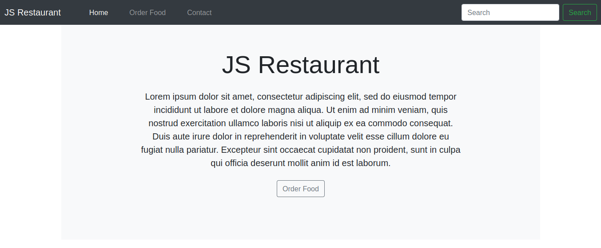
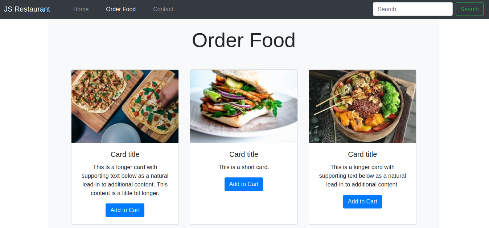

# Restaurant Page Using Java Script
Project to practice DOM manipulation by dynamically rendering a simple restaurant homepage!  using JavaScript alone to generate the entire contents of the website!

## Built With

- JavaScript
- Webpack
- Bootstrap

### Prerequisites

- Any kind of browser supporting CSS3 and HTML5

### Setup

- Fork the repo to your remote repository.
- Clone or download the repository to your local machine.

### Install

- clone the project
- switch to dist folder [ `cd dist` ]
- open index.html in browser

- to use project in dev mode
  - install reqired project using npm [`npm install`] 
  - start editing js files in `src` directory and run webpack [ `npx webpack `]

### Usage

- Visit the live demo link on your web browser.

## Author

👤 **Karthick Venkatesan**

- [Portfolio](https://karthi07.github.io/)
- [LinkedIn](https://www.linkedin.com/in/karthickvenkadesan/)
- [GitHub](https://github.com/karthi07)
- [E-mail](itkarthi02@gmail.com)

## 🤝 Contributing

Contributions, issues and feature requests are welcome!

Feel free to check the [issues page](https://github.com/karthi07/restaurant_page_js/issues).

## Show your support

Give a ⭐️ if you like this project!